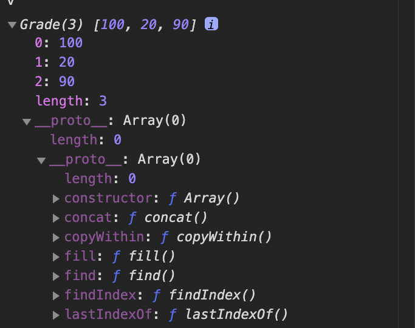

# 자스 클래스

2020.03.17

## 잠깐 용어정리

- superclass : 상위 클래스
- subclass : 하위 클래스
- instance : 어떤 클래스의 속성을 지니는 실존하는 개체를 일컫는 말, 사례, 어떤 조건에 부합하는 구체적인 예시
- 현실세계에서는 개체들이 이미 존재하는 상태에서 이들을 구분짓기 위해 클래스를 도입함. 이때문에 하나의 개체가 같은 레벨에 있는 서로 다른 여러 클래스의 인스턴스일 수 있음
- 프로그래밍 언어상에서는 접근 방식이 정반대인데, 컴퓨터는 위와 같은 구분법을 알지 못하므로 사용자가 직접 여러 가지 클래스를 정의해야 함.
- 클래스를 바탕으로 인스턴스를 만들 때 비로소 어떤 개체가 클래스의 속성을 지니게 됨.
- 또한 한 인스턴스는 하나의 클래스만을 바탕으로 만들어짐. 어떤 인스턴스가 다양한 클래스의 속할 수는 있지만 클래스들은 모두 인스턴스 입장에서는 직계존속임.
- 다중상속을 지원하는 언어이든 그렇지 않든 결국 인스턴스를 생성할 때 호출할 수 있는 클래스는 오직 하나뿐.
- **프로그래밍 언어에서의 클래스는 현실 세계에서의 클래스와 마찬가지로 공통 요소를 지니는 집단을 분류하기 위한 개념이라는 측면에서는 일치하지만, 인스턴스들로부터 공통점을 발견해서 클래스를 정의하는 현실과는 달리, 클래스가 먼저 정의되어야만 그로부터 공통적인 요소를 지니는 개체들을 생성할 수 있음**

## 자스의 프로토타입 => 클래스

- 자스는 클래스 개념이 없는 프로토타입 기반 언어이지만, 일반적인 의미에서의 클래스 관점에서 접근해보면 비슷하게 해석할 수 있는 요소가 있음.
- 프로토타입으로 인스턴스를 찍어내는 것은 엄밀히 말하면 프로토타입 체이닝에 의한 **참조** 뭐 대충보면 array라는 프로토타입 객체 내부 요소들이 인스턴스에 의해 **상속**된다고 볼 수 있음.
- 인스턴스에 상속되는지 여부에 따라 스태틱 멤버와 인스턴스 멤버로 나뉨. 여느 클래스 기반 언어와 달리 자바스크립트에서는 인스턴스에서도 직접 메소드를 정의할 수 있다는 점이 다른점,,
- **프로토타입 메서드** : 인스턴스에서 바로 호출할 수 있는 메서드

```javascript
// 프로토타입은 "참조"의 결과물이므로 인스턴스에서도 프로토타입을 바로 수정해버릴 수 있다
var Rectangle = function(width, height) {
  this.width = width;
  this.height = height;
};
// 프로토타입 메서드 : 인스턴스에서 직접 호출 가능
// 프로토타입 체이닝의 근거가 됨, 인스턴스의 __proto__ 안에 그리고 생성자의 prototype에 있음
Rectangle.prototype.getArea = function() {
  return this.width * this.height;
};

// 스태틱 메서드
// 생성자에 선언하는 메소드, 인스턴스에서 호출하면 __proto__에서 발견할 수 없음
// 생성자 함수를 this로 해야만 호출 가능해짐
Ractangle.isRectangle = function(instance) {
  return (
    instance instanceof Rectangle && instance.width > 0 && instance.height > 0
  );
};

var rect1 = new Rectangle(3, 4);
console.log(rect1.getArea()); // 12
console.log(rect1.isRectangle(rect1)); // error
console.log(Rectangle.isRectangle(rect1)); // true
```

- 프로그래밍 언어에서의 클래스는 사용하기에 따라 추상적일수도 있고 구체적인 개체가 될 수도 있다 : 일반적인 사용 방식, 즉 구체적인 인스턴스가 사용할 메서드를 정의한 틀의 역할을 담당하는 목적을 가질때의 클래스는 추상적인 개념이지만, 클래스 자체를 this로 해서 직접 접근 해야만 하는 스태틱 메서드를 호출할 때의 클래스는 그 자체가 하나의 개체로서 취급됨.

## 자스 프로토타입으로 상속 따라하기

- 일단 문제가 있는 것들로는
  1. 프로토타입은 참조를 하기 때문에 붕어빵틀인 클래스처럼 멤버변수를 계속 들고다니지 않고 configurable해버림
  2. 내장 객체의 인스턴스가 가진 프로퍼티의 경우 속성값에 따라(불리언) 삭제 여부가 정해짐
  3. 클래스에 있는 값이 인스턴스의 동작에 영향을 계속 줌 : 클래스의 추상성을 해친다
  4. 진정한 "틀"일 수가 없다는 이야기 : 클래스에 있는 값들이 인스턴스의 동작에 영향을 준다 => 프로토타입 채이닝때문에 인스턴스 맴버변수 같은거에 접근해서 뭘 좀 수정하거나 삭제해도 `__proto__`를 타고넘어와서 다른 값을 찾아버린다녕
- 해결방법

  1. 클래스가 구체적인 데이터를 지니지 않게 하면 되는데, 그럴려면 `Object.freeze(square.prototype)` 쓰면 댄다
  2. 빈 함수(bridge)를 이용하여 프로토타입 체이닝을 끊어버린다.

  ```javascript
  var Rectangle = function(width, height){
      this.width = width;
      this.height = height;
  }
  Rectangle.prototype.getArea = function() {
      return this.width * this.height
  }
  var Square = function(width) {
      Rectangle.call(this, width, width)
  }
  var Bridge = fucntion(){};

  Bridge.prototype = Rectangle.prototype;
  Square.prototype = new Bridge();
  Object.freeze(Square.prototype);
  ```

  3. `Object.create`사용하기

  ```javascript
  Square.prototype = Object.create(Rectangle.prototype);
  ```

### 복습) 프로토타입 삼각형 수정하기

```javascript
var Grade = function() {
  var args = Array.prototype.slice.call(arguments);
  for (var i = 0; i < args.length; i++) {
    this[i] = args[i];
  }
  this.length = args.length;
};
var g = new Grade(100, 80);
```

1. 여기서 변수 g는 Grade의 인스턴스를 바라봄
2. Grade의 인스턴스는 여러개의 인자를 받아 각각 순서대로 인덱싱해서 저장하고, length프로퍼티가 존재하지만 배열은 아니고 유사배열객체라서 배열 메소드를 사용할 수 없다
3. 인스턴스에서 배열 메소드를 직접 쓰게끔 하려면, `g.__proto__`가 배열의 인스턴스를 바라보게 하면 된다. 안바뀌었을 때는 object인데
4. `Grade.prototype = [];`, 요 아래처럼 되서 배열의 `__proto__`를 채이닝해서 배열의 매소드에 접근할 수 있게 된다.
   

## es6 클래스 문법

```javascript
const ES6 = class {
  // 프로토타입의 생성자와 동일한 역할을 수행
  constructor(name) {
    this.name = name;
  }
  // 생성자 자신만이 호출할 수 있는 static 메소드
  static staticMethod() {
    return this.name + "staticMethod";
  }

  // 인스턴스가 호출할 수 있는 프로토타입 메소드
  method() {
    return this.name + "method";
  }
};

const es6Instance = new ES6("es6");

// super로 상속을 받음
var Rectangle = class {
  constructor(width, height) {
    this.width = width;
    this.height = height;
  }
  getArea() {
    return this.width * this.height;
  }
};
var Square = class extends Rectangle {
  constructor(width) {
    super(width, width);
  }
  getArea() {
    console.log("size is:".super.getArea());
  }
};
```
