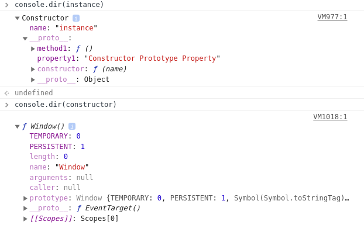

# 프로토타입 개념

2020.02.17

## 정의

자바스크립트는 프로토타입 기반 언어  
클래스 기반 언어에서는 상속을 사용하지만 프로토타입 기반 언어에서는  
**어떤 객체를 원형으로 삼고 이를 복제함**으로써 상속과 비슷한 효과를 얻는다.

## 개념 이해하기

```javascript
var instance = new Constructor();
```

- 어떤 생성자 함수(Constructor)를 new 연산자와 함께 호출하면
- Constructor에서 정의된 내용을 바탕으로 새로운 인스턴스가 생성됨
- 이때 instance에는 **proto**라는 프로퍼티가 자동으로 부여되는데
- 이 프로퍼티는 Constructor의 prototype이라는 프로퍼티를 참조
- **Constructor의 prototype프로퍼티**와 **instance의 **proto**프로퍼티** : 구분!

prototype 프로퍼티는 객체이며, **proto**프로퍼티 역시 객체  
prototype 객체 내부에는 인스턴스가 사용할 메서드를 저장  
그러면 인스턴스에서도 숨겨진 프로퍼티인 **proto**를 통해 **이 메서드에 접근**할 수 있게 됨

> **proto**에 직접 접근하는 행위는 브라우저에서 만들어낸 방법  
> 명세에서는 `[[prototype]]`으로 되어있는데, instance.**proto**이런 식으로 접근하는 것은 허용하지 않고, 오직 `Object.getPrototypeOf(instance)`이런 식으로만 접근할 수 있도록 정의했었음

```javascript
var Person = function(name) {
  this._name = name;
};

//Person Constructor의 메소드로 getName을 만들었다
Person.prototype.getName = function() {
  // 여기서 this는 Person객체안 일 것
  return this._name;
};

var suzi = new Person("Suzi");
// suzi라는 인스턴스 안에서도 getName에 접근할 수 있다
Person.prototype === suzi.__proto__; //true
```

> **곁가지 - 왜 메서드 호출 결과가 undefined인가?**
> 팩트) 일단 에러가 안나왔다는 점 => 실행이 되었고, 이로부터 메소드가 함수임이 입증되었음  
> 어떤 함수를 메서드로서 호출할 때는 메서드명 바로 앞의 객체가 곧 this  
> 그러니까 `thomas.__proto__.getName()`에서 함수 내부에서의 this는 `thomas`가 아니라 `thomas.__proto__`라는 객체가 되는 것(마지막 마침표를 기준삼아)  
> 그래서 이 객체에는 name프로퍼티는 없으므로 찾고자 하는 식별자가 정의되어 있지 않은 상태고, undefined를 반환하는 것

this를 인스턴스로 하려면 => 간단하게 그냥 인스턴스에서 메서드 쓰면 된다

```javascript
// suzi.__proto__.getName() === suze.getName()
suzi.getName();
```

엥 왜그렇지??? 인스턴스의 메서드는 **proto**객체에 들어가 있는데 인스턴스에서 호출이 가능하다구???  
=> 의외로 **proto**는 **생략이 가능한 프로퍼티** : 그냥 아이크찡이 원래부터 생략 가능한 프로퍼티로 만들었음. 그냥 그런가 보다 하자.

한줄요약 1) **proto**에 있는 메소드를 실행하지만, this는 인스턴스를 바라본다**  
한줄요약 2) new 연산자로 Constructor 호출하면 instance가 만들어지는데, instance의 **생략 가능한 프로퍼티**인 **proto\*\*는 Constructor의 prototype을 참조한다  
=> 즉, 생성자 함수의 prototype에 어떤 메소드나 프로퍼티가 있다면, 인스턴스에서도 마치 자신의 것처럼 해당 메서드나 프로퍼티에 접근할 수 있게 됨



> enumerable property 는 열거 가능한 프로퍼티, 옅은색은 그럴 수 없는 프로퍼티. for in등으로 객체의 프로퍼티 전체에 접근하고자 할 때 접근 가능 여부를 색상으로 구분지어 표기한다.

어떤 생성자 함수의 인스턴스는 해당 생성자 함수의 이름을 표기함으로써 해당 함수의 인스턴스임을 표기하고 있음 => instance 보여달라 했는데 Constructor 어쩌구 나오는 이유

## constructor 프로퍼티

생성자 함수의 프로퍼티인 prototype 객체 내부에는 constructor라는 프로퍼티가 있음  
이 프로퍼티는 단어 그대로 원래의 생성자 함수를 참조함  
뭐하러 자신을 참조하는걸 굳이 갖고있나 싶지만, 인스턴스로부터 그 원형이 무엇인지 알 수 있는 수단이 됨

```javascript
var arr = [1, 2];
// 인스턴스의 constructor 프로퍼티는 생성자 함수 그대로를 참조하니 인스턴스로부터 접근하여 쇄로운 배열을 만들어내는 것 가능
var arr2 = new arr.constructor(3, 4);
```

인스턴스의 **proto**가 생성자 함수의 prototype 프로퍼티를 참조하여 **proto**가 생략 가능하기 때문에 인스턴스에서 직접 constructor에 접근할 수 있는 수단이 생긴 것

constructor은 읽기 전용 속성이 부여된 예외적인 경우를 제외하고는 값을 바꾸는게 가능=> 하지만 참조되는 대상이 변경될 뿐 이미 만들어진 인스턴스의 원형이 바뀐다거나 데이터 타입이 변하는 것은 아님 => 어떤 인스턴스의 생성자 정보를 알아내기 위해 constructor에 의존하는 것은 항상 안전하지 않다!

다양한 constructor 접근 방법

```javascript
var person = function(name) {
  this.name = name;
}
// 그냥 생성자 사용
var p1 = new Person('사람1');
var p1proto = Object.getPrototypeOf(p1);
// 생성자 함수의 프로토타입(함수 본인 참조)의 컨스트럭터
var p2 = new Person.prototype.constructor('사람2');
// 프로토타입 생성자의 컨스트럭터
var p3 = new p1Proto.constructor('사람3');
// 인스턴스 __proto__ 프로퍼티에 있는 prototype 프로퍼티의 constructor
var p4 = new p1.__proto__.constructor('사람4');
// 프로토는 생략 가능
var p5 = new p1.constructor('사람5');'

[p1,p2,p3,p4,p5].forEach(function(p){
  console.log(p, p instanceof Person);
  // 모두 true
});
```

## Reference

- [코어 자바스크립트 - 프로토타입](http://www.yes24.com/Product/Goods/78586788?scode=032&OzSrank=1)
