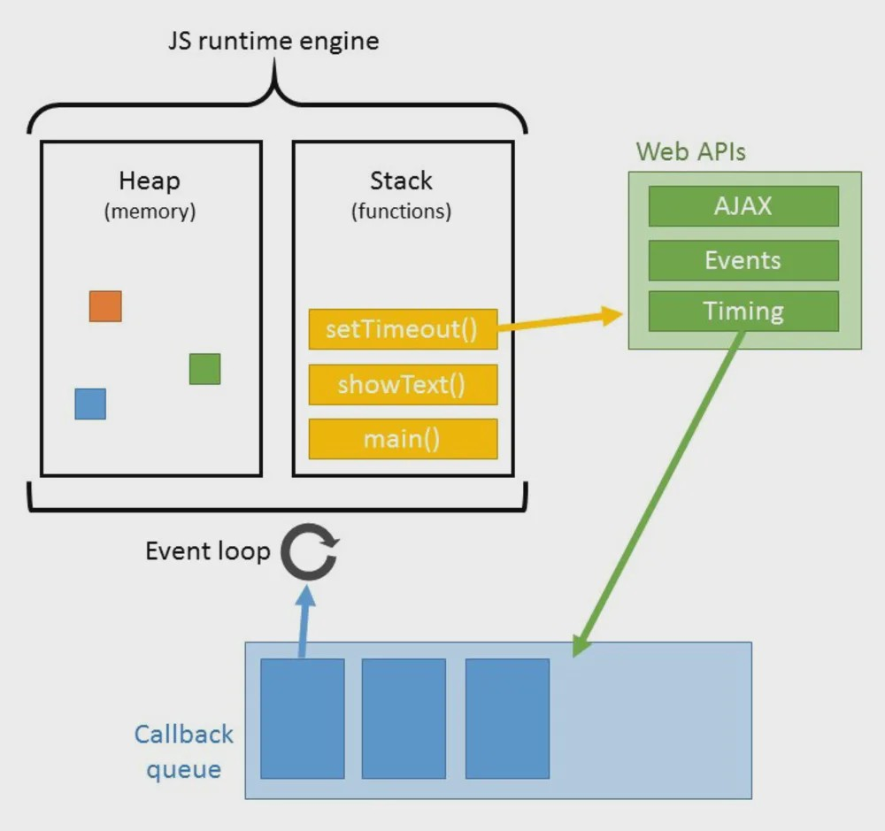

# node.js 개관
2020.02.08

## 서버에 왜 자스를 쓰나
서버의 정확한 정의 : 서버는 네트워크를 통해 클라이언트에 정보나 서비스를 제공하는 **컴퓨터 또는 프로그램**  
node.js란 : 크롬 v8 자바스크립트 엔진으로 빌드된 자바스크립트 런타임. 이벤트 기반, 논블로킹 IO모델을 사용했음, 크롬 v8엔진이 정말 빨라서 서버를 만들기가 좋아졌다.

## 노드 런타임의 특징
### 이벤트 기반
이벤트가 발생할 때 미리 지정해둔 작업을 수행하는 방식  
이벤트 루프 자세한 동작은 [#자스 비동기 프로그래밍](../javascript/promise)에서 확인

### 논블로킹 I/O
I/O란 입출력, 논블로킹이란 이전 작업이 완료될 때까지 멈추지 않고 다음 작업을 수행함  
비동기랑은 조금 다른 개념인데, 일단은 유사한 개념으로 이해하기  
web api에 걸리는 코드들로 빌드하면 논블로킹 방식(비동기)로 바뀐다(일단)  
```javascript
function longRunningTask() {
  console.log('작업 끝')
}
console.log('시작')
// 0초로 설정해도 비동기는 비동기!
setTimeOut(longRunningTask, 0);
console.log('다음작업')
```
### 싱글 스레드
주어진 작업을 스레드 하나에서만 처리한다 == 논블로킹이 중요한 이유이기도 함  
한번에 한 가지 일밖에 처리하지 못하므로 어떠한 작업에서 블로킹이 발생하면 다음 일 처리 못함  

>**프로세스와 스레드의 차이**  
프로세스 : 운영체제에서 할당하는 작업의 단위 => 프로세스 간에는 메모리 등의 자원을 공유하지 않음
스레드 : 프로세스 내에서 실행되는 흐름의 단위 => 부모 프로세스의 자원을 공유함
노드 프로세스 > 여러가지 스레드 > 내가 제어하는 스레드

## 서버로서의 노드
### 장
1. 멀티 스레드 방식에 비해 컴터 자원을 적게 사용
2. I/O가 많은 서버로 적합 : 논블로킹 방식이기 때문
3. 웹 서버가 내장되어 있음(이말 무슨말?)
4. JSON이랑 좋은 궁합
### 단
1. 싱글 스레드라서 CPU 코어 하나만 사용(여기서는 서버컴터겠져)
2. CPU작업이 많은 서버로는 부적합
3. 하나뿐인 스레드가 멈추면 재앙임(버그에 민감하다는 말)
4. 성능이 어중간함

## reference
- [Node.js 교과서]()