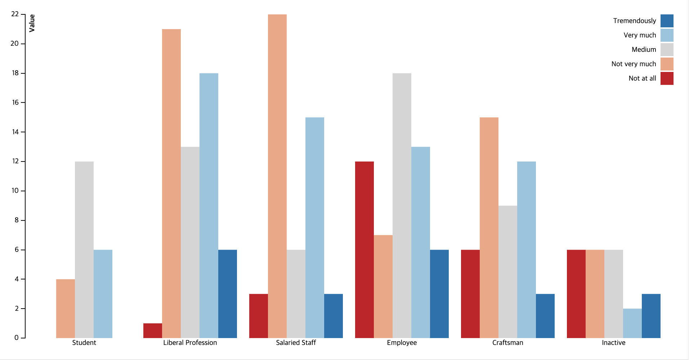

# d3.js
공부해놓으면 써먹을 수 있을지 모른다  
2020.04.23

## 원리


```js
var dataset = [ 15, 5, 32, 20, 21 ];
d3.select("body")          // 1. 있는 태그 불러온다
  .selectAll("p")          // 2. 작업공간 선택 + 존재하지 않는 태그 선택
  .data(dataset)           // 3. 데이터 바인딩(숫자만큼 새로운 작업공간+데이터 생김)
  .enter()                 // 4. 바인드가 되지 않은 요소에 데이터를 넣어 elem반환
  .append("p")             // 5. 데이터 공간 수 만큼 문서요소 만들기(실제적으로 생성되는 태그)
  .text("hi jeongpro!");   // 6. 해당 p태그들에 텍스트 삽입
```

1. 데이터를 불러온다
2. 작업할 공간을 선택한다
    - 이때 **존재하지 않는 태그**를 선택해야 한다
3. 공간에 불러온 데이터를 연결한다
    - enter()
    - 하위 태그를 새로 만들어(데이터의 숫자와 동일한 개수의) 거기다가 바인딩을 해주는 느낌
    - 어찌보면 가상돔과 비슷하다
4. 각각 연결한 것을 그린다

## 코드 분석

### 그룹 막대 그래프


```html
<!DOCTYPE html>
<meta charset="utf-8">
<style>

body {
  font: 10px sans-serif;
}

/*svg 스타일 속성인거 같은데 뭔지 잘 모르겠음 => 알아보기*/
.axis path,
.axis line {
  fill: none;
  stroke: #000;
  shape-rendering: crispEdges;
}

.x.axis path {
  display: none;
}

</style>
<body>
<script src="https://d3js.org/d3.v3.min.js"></script>
<script>

// 1. 크기
var margin = {top: 20, right: 20, bottom: 30, left: 40},
    width = 960 - margin.left - margin.right,
    height = 500 - margin.top - margin.bottom;

var x0 = d3.scale.ordinal()
    .rangeRoundBands([0, width], .1);

var x1 = d3.scale.ordinal();

var y = d3.scale.linear()
    .range([height, 0]);

var xAxis = d3.svg.axis()
    .scale(x0)
    .tickSize(0)
    .orient("bottom");

var yAxis = d3.svg.axis()
    .scale(y)
    .orient("left");

var color = d3.scale.ordinal()
    .range(["#ca0020","#f4a582","#d5d5d5","#92c5de","#0571b0"]);

// 요까지 컨피그로 두고 

// useref했다고 생각하고
var svg = d3.select('body').append("svg")
    .attr("width", width + margin.left + margin.right)
    .attr("height", height + margin.top + margin.bottom)
    .append("g")
    .attr("transform", "translate(" + margin.left + "," + margin.top + ")");

// 데이터 패칭해서 축 데이터에 넣고
d3.json("data.json", function(error, data) {

  var categoriesNames = data.map(function(d) { return d.categorie; });

  // 어짜피 뒤로 가도 똑같으니 거기서만 가져온 것
  var rateNames = data[0].values.map(function(d) { return d.rate; });

  // X축에 들어가는거 두개 깔고 간다
  x0.domain(categoriesNames);
  x1.domain(rateNames).rangeRoundBands([0, x0.rangeBand()]);
  // 뭔가 자료형 값 중에서 max를 뱉는 함수인듯
  y.domain([0, d3.max(data, function(categorie) { return d3.max(categorie.values, function(d) { return d.value; }); })]);

  // 그리는 단계 = translate는 위치인거같음(이게 좀 지랄맞은듯)
  // x축
  svg.append("g")
      .attr("class", "x axis")
      .attr("transform", "translate(0," + height + ")")
      .call(xAxis);
  // y축
  svg.append("g")
      .attr("class", "y axis")
      .style('opacity','0')
      .call(yAxis)
      .append("text")
      .attr("transform", "rotate(-90)")
      .attr("y", 6)
      .attr("dy", ".71em")
      .style("text-anchor", "end")
      .style('font-weight','bold')
      .text("Value");

  // 클래스 y 선택해서 트랜지션 효과 (페이드인)
  svg.select('.y').transition().duration(500).delay(1300).style('opacity','1');

  // 이거 어디서 선택한거지 => 데이터 바인딩 + g태그 삽입 + g클래스 삽입
  var slice = svg.selectAll(".slice") // 임의의 공간
      .data(data)
      .enter().append("g") // 태그는 g
      .attr("class", "g") // 클래스도 g
      .attr("transform",function(d) { return "translate(" + x0(d.categorie) + ",0)"; });

// 그래프 그리는 단계 => 그 g태그안에 rect를 선택
  slice.selectAll("rect")
       //  rect는 value 개수만큼 elem안에 들어감
      .data(function(d) { return d.values; })
       // 진짜로 rect가 만들어지는 시점 (엔터 뒤에서)
      .enter().append("rect")
      // 이런저런 속성들을 넣는다
      .attr("width", x1.rangeBand())
      .attr("x", function(d) { return x1(d.rate); })
      .style("fill", function(d) { return color(d.rate) })
      .attr("y", function(d) { return y(0); })
      .attr("height", function(d) { return height - y(0); })
      // 이벤트
      .on("mouseover", function(d) {
          d3.select(this).style("fill", d3.rgb(color(d.rate)).darker(2));
      })
      .on("mouseout", function(d) {
          d3.select(this).style("fill", color(d.rate));
      });

// 트랜지션
  slice.selectAll("rect")
      .transition()
      .delay(function (d) {return Math.random()*1000;})
      .duration(1000)
      .attr("y", function(d) { return y(d.value); })
      .attr("height", function(d) { return height - y(d.value); });

  //Legend = 팻말, 위치지정
  var legend = svg.selectAll(".legend")
      .data(data[0].values.map(function(d) { return d.rate; }).reverse())
      .enter().append("g")
      .attr("class", "legend")
      // 0,20/0,40 이런식으로 위치지정 되어있다
      .attr("transform", function(d,i) { return "translate(0," + i * 20 + ")"; })
      .style("opacity","0");

 // 팻말 안의 네모난 친구들
  legend.append("rect")
      .attr("x", width - 18)
      .attr("width", 18)
      .attr("height", 18)
      .style("fill", function(d) { return color(d); });

  // 레전드 안의 글자 친구들
  legend.append("text")
      .attr("x", width - 24)
      .attr("y", 9)
      .attr("dy", ".35em")
      .style("text-anchor", "end")
      .text(function(d) {return d; });

  legend.transition().duration(500).delay(function(d,i){ return 1300 + 100 * i; }).style("opacity","1");

});

</script>
```

### 꺾은선 그래프

```js
//* 1. 마진 설정 크기 설정 + 배경 엘리멘트 만듬
var svg = d3.select("svg"), // svg태그 선택
    margin = {top: 20, right: 20, bottom: 30, left: 50},// 그래프에서 margin을 정함
    width = +svg.attr("width") - margin.left - margin.right, // 전체 width에서 양쪽 마진 제외
    height = +svg.attr("height") - margin.top - margin.bottom,// 전체 heigth에서 위아래로 마진 제외
    g = svg.append("g").attr("transform", "translate(" + margin.left + "," + margin.top + ")");
    //svg에 <g>태그를 넣고 속성을 넣음 <g transform="translate(50,20)">

var parseTime = d3.timeParse("%d-%b-%y");
//시간 파싱 함수(뭐하는 친군지 잘 모름)

//* x축, y축 생성
//x축은 시간값 범위 0~width
var x = d3.scaleTime()
    .rangeRound([0, width]);

//y축은 linear 순차적인 값, 범위 height~0
var y = d3.scaleLinear()
    .rangeRound([height, 0]);

//* 꺾은선 그래프 그릴거다 
//y축은 좌상단이 (0,0)이고 y값이 증가할수록 밑으로 내려가도록 그리기때문
var line = d3.line()
    .x(function(d) { return x(d.date); })
    .y(function(d) { return y(d.close); });
//d3.line()으로 선을 그리는데 x값은 콜백으로 x(데이터.date값), y값은 y(데이터.close값)

//d3.tsv로 tsv파일을 읽을 수 있음
d3.tsv("data.tsv", function(d) {
  d.date = parseTime(d.date);
  d.close = +d.close;
  return d;
}, function(error, data) {
  if (error) throw error;

//d3.extent는 [최소,최대] 시작과 끝 직선 어디만큼 그릴지를 리턴
//domain은 입력 값의 구간, range는 출력 값의 범위
  x.domain(d3.extent(data, function(d) { return d.date; }));
  y.domain(d3.extent(data, function(d) { return d.close; }));
 
//aixs는 x축선과 y축선을 그리기위한 용도다.
//x축
  g.append("g")
      .attr("transform", "translate(0," + height + ")")
      .call(d3.axisBottom(x))
      .select(".domain")
      .remove();
//y축
  g.append("g")
      .call(d3.axisLeft(y))
      .append("text")
      .attr("fill", "#000")
      .attr("transform", "rotate(-90)")
      .attr("y", 6)
      .attr("dy", "0.71em")
      .attr("text-anchor", "end")
      .text("Price ($)");
//데이터선
  g.append("path")
      .datum(data)
      .attr("fill", "none")
      .attr("stroke", "steelblue")
      .attr("stroke-linejoin", "round")
      .attr("stroke-linecap", "round")
      .attr("stroke-width", 1.5)
      .attr("d", line);
});
```
## svg


## 리액트에서 사용

## 의문점
- 반응형?

## reference

- [D3.js 사용법을 알기 위한 튜토리얼 예제 분석](https://jeong-pro.tistory.com/149)