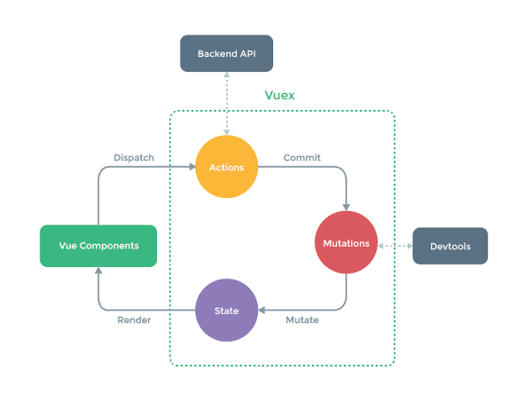

# Vuex
2020.01.21  
드디어 배워보는 뷰엑스

## 구조
[flux아키텍처](flux.md)의 메커니즘을 사용함  

  

액션(Actions), 변이(Mutations), 상태(State), 뷰 컴포넌트(Vue Componenent)  
전체 흐름은 flux의 그것과 유사  

### 상태(State) 
**저장소가 지닌 상태값/컴포넌트와 저장소와의 연결**
모델을 의미함. 상태는 단일 상태 트리를 사용 원본 소스의 역할  
스토어에 연결된 컴포넌트는 저장소의 상태가 변경되면 변경 사항을 컴포넌트에 반영  
컴포넌트에서 스토어의 상태에 접근해서 가져올 때는 `computed`내에 작성
```javascript
// 스토어의 데이터를 컴포넌트와 연결하기
// 어디까지나 가져오는 것만 할 수 있을 뿐이고, computed를 이용해서 한번 가공한 다음에 내보낼 수 있음
<template>
  <div>
    {{count}}
  </div>
</template>

<script>
export default{
  computed :{
    count() {
      return this.$store.state.count;
    }
  }
}
</script>
```  
store.state.count의 값은 computed 속성에 포함되어 있으므로 store, state, count값이 변경되면 컴포넌트의 computed 또한 자동으로 갱신되어 **관련된 DOM의 업데이트가 발생함**  
store 옵션을 통해 루트 컴포넌트의 모든 자식 컴넌에 저장소 주입 가능(모든 하위 컴포에서 참조 가능하게)  
`this.$store`로 접근 가능함
```javascript
// mapState 헬퍼 함수를 이용해 여러 데이터를 한 블록 안에 간결하게 정리
<template>
  <div>
    {{count}} + {{number}} = {{sum}}
  </div>
</template>

<script>
import {mapState} from 'vuex';

export default{
  data() {
    return{
      number:3
    }
  },
  computed : mapState({
    // mapstate 함수 이용, 인자들을 함수로 받는다
    // count 업데이트
    count: state => state.count,
    // sum 업데이트
    sum(state) {
      return state.count + this.number
    }
  })
}
</script>
```
### 게터(Getters)
**state을 가공하는 로직/store의 computed**
스토어 내에서 Vue의 Computed와 같은 역할을 수행함  
컴포넌트에서 가공하지 않아도 스토어에서 가공해서 컴포넌트에 데이터를 보냄  
로직 재사용에 이점을 가짐  
```javascript
export default new Vuex.Store({
  state: {
    count :2
  },
  getters: {
    muiltiply: state => state.count * state.count
  }
})
```
게터는 computed와 마찬가지로 내부에서 사용된 데이터가 변경될 때마다 자동으로   갱신되고 한번 계산된 후로는 전까지는 반환되는 값이 캐싱됨  
게터 안의 함수는 첫번째 인자로 속해있는 스토어의 상태를, 두번째 인자로 게터 자체를 전달받음  
```javascript
// 게터 안의 함수는 게터 자신, 상태값 다 참조 가능
getters:{
  add: state => {
    return state.count + state.count
  },
  // this라고 쓰면 안대나??! 
  multyply: (state, getters) => {
    return getters.add * state.count
  }

// 게터 로직에 접근할 때
store.getters.add
store.getters.multiply

// 컴넌 안에서
computed: {
  doneMemosCount() {
    return this.$store.getters.add
  }
}
```
### 변이(Mutation)
**컴포넌트에서 state를 동기적으로 업데이트 하는 방법**
변이는 Vuex에서 스토어의 상태를 변경할 수 있는 유일한 방법  
각 변이 함수의 이름은 **Flux의 액션 타입과 동일** 함수 내용은 실제 수정을 할 수 있는 로직을 가지고 있음, 플럭스에서의 디스패처  
```javascript
export default new Vuex.Store({
  state : {
    count: 2
  },
  mutations:{
    INCREMENT (state, payload){
      state.count = state.count + payload
    }
  }
})
```
변이 핸들러 함수는 첫번째 인자로 스토어의 상태를, 두번째로는 페이로드를 받음  
변이는 게터와는 다르게 `store.mutation`으로 직접 접근할 수 없음  
변이는 디스패처의 역할과 마찬가지로 어떤 액션이 들어왔을 때 **그 액션이 가지고 있는 타입과 일치하는 함수**를 실행시킴. 
```javascript
// 컴포넌트에서는 commit을 사용하여 변이를 호출한다
// commit이 type을 호출하고, 변이는 이 type action에 대응하는 함수를 실행한다
export default {
  methods:{
    increment() {
      this.$store.commit('INCREMENT', 2)
    }
  }
}

// 하나 이상의 인자 사용 
export default new Vuex.Store({
  state: {
    count: 2
  },
  mutations: {
    DECREMENT(state, payload) {
      state.count = state.count - payload.count
      // 컴포넌트에서 객체로 필요한 값들을 전달하면 된다
    }
  }
})
```
**변이 안에서는 동기적인 로직만 사용하자**. 작동은 하는데... 일단 비동기 처리에 좋은 actions랑 헷갈린다.   
뷰데브툴은 변이를 추적할 때 commit 메소드가 언제 호출되었는지를 기준으로 추적하므로, 비동기로직이 처리가 안 되었음에도 불구하고 상태가 변이되었다고 뜰 수 있음. 상태 추적을 힘들게 만든다  

### 액션(Actions)
**컴포넌트에서 state를 비동기적으로 업데이트한다**
액션의 두가지 역할 - 변이에 대한 커밋, 비동기 처리
```javascript
export default new Vuex.Store({
  state : {
    count :2
  },
  mutations : {
    INCREMENT(state, payload) {
      state.count = state.count + payload
    }
  },
  actions: {
    increment(context, payload) {
      context.commit("INCREMENT", payload)
    }
  }
})
```
액션 핸들러의 두 메소드 - context, payload  
context는 스토어의 메소드, 속성들을 그대로 가지고 있는 값(메소드 그대로 실행 가능)  
액션은 dispatch라는 메소드를 통해 사용할 수 있음  
변이랑 똑같이 핸들링이 되는 거 같음

```javascript
export default {
  methods:{
    increment() {
      this.$store.dispatch('increment', 3);
    }
  }
}
```
변이랑 다른 점이, 액션을 사용하면 비동기 처리 후 변이를 사용하게 할 수 있음
```javascript
state: {
  userInfo:null,
},
mutations: {
  SET_USER_INFO_REQUEST(state) {
    console.log("유저 데이터를 서버에 요청합니다")
  },
  SET_USER_INFO_SUCCESS(state, payload){
    state.userInfo = payload
  }
},
actions : {
  setAsyncUserInfo({commit}, userId) {
    commit('SET_USER_INFO_REQUEST')
    api.fetchUserInfo(response => {
      commit('SET_USER_INFO_SUCCESS', response.data.user)
    })
  }
}
```
액션 헨들러는 서버와 통신하여 사용자 데이터를 받아오고 그 후 변이를 요청하는 commit 메서드를 호출한다. 이런 방식의 변이는 데브툴에서 commit의 호출을 인식했을 때 동기적으로 상태가 업데이트되므로 제대로 된 상태 추적이 가능하게 한다.

**정리**
- 동기로직 : 변이 -> 커밋 호출  
- 비동기 로직: 액션 -> 변이 -> 커밋 호출(변이를 액션이 감싸고 있다고 생각하면 편한듯)  

## Vuex 모듈 관리하기
애플리케이션 커질수록 각각의 메소드들로 파일을 분리하기 마련인데, 그럼에도 저장소가 매우 비대해질 수 있어서 보기 복잡함  
그럴때 쓰는것 => modules옵션  
일단 만들어보다가 복잡할거 같으면 분리하는게 현명하다

```javascript
// 각각의 상태값을 가진다
const moduleA = {
  state: { ... },
  mutations: { ... },
  actions: { ... },
  getters: { ... }
}

const moduleB = {
  state: { ... },
  mutations: { ... },
  actions: { ... }
}

const store = new Vuex.Store({
  modules: {
    a: moduleA,
    b: moduleB
  }
})

store.state.a // -> moduleA'의 상태
store.state.b // -> moduleB'의 상태
```

## reference
- [커피한잔 마시며 끝내는 Vue.js - Vuex](http://www.yes24.com/Product/Goods/76639545)
- [vue.js guide Vuex - 모듈](https://vuex.vuejs.org/kr/guide/modules.html)